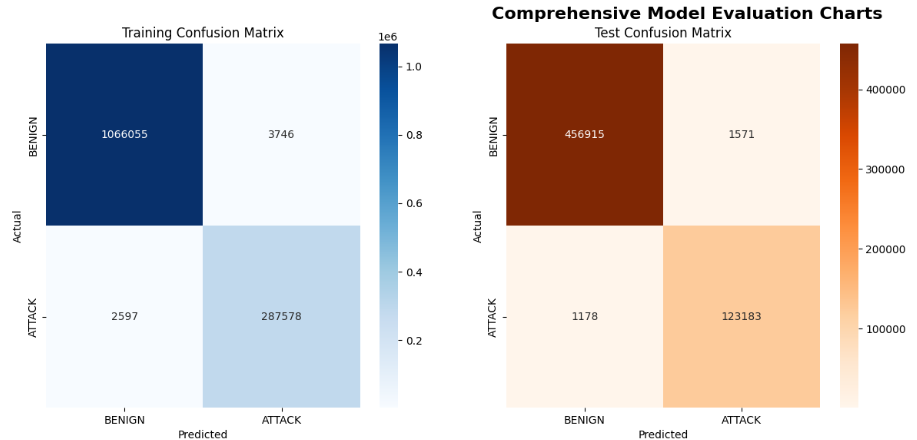

🛡️ Machine Learning Intrusion Detection System for Network Security
A robust, end-to-end machine learning pipeline designed to classify network traffic as either BENIGN or ATTACK. This project was developed as a practical tool for a Security Operations Center (SOC) analyst, demonstrating key skills in data analysis, model training, and real-world application simulation.

🎯 The Problem
In today's digital landscape, networks are constantly under threat from a variety of cyber attacks, including DDoS, Port Scans, and Botnets. A Security Operations Center (SOC) analyst is tasked with sifting through millions of network events to identify these threats. This manual process is time-consuming and prone to human error, creating a need for automated systems that can intelligently flag suspicious activity.

💡 The Solution
This project implements a machine learning pipeline to automate the detection of network intrusions. By training a Random Forest Classifier on the comprehensive CIC-IDS-2017 dataset, the system learns the distinct patterns and "fingerprints" of malicious traffic.
The final model is a lightweight, efficient tool that can rapidly analyze new network data and classify each connection as either benign or an attack, providing analysts with a clear and immediate verdict. The focus is on binary classification (Benign vs. Attack), as this directly addresses the primary real-world question for a SOC analyst.

✨ Key Features
End-to-End Pipeline: A complete workflow from raw data cleaning and preprocessing to model training, validation, and prediction.
Data Leakage Prevention: Implements best practices like splitting data before scaling to ensure a realistic and reliable model evaluation.
Interpretability: Provides a feature importance analysis to understand why the model makes its decisions, a critical aspect for any security tool.
Model Persistence: The trained model and its components are saved to disk (.pkl files), allowing for instant predictions on new data without the need for retraining.
Modular & Reusable Code: The core logic is encapsulated in a Python class (ImprovedNetworkIntrusionDetector) for clean, maintainable, and reusable code.
Realistic Simulation: Includes separate scripts for training (train_model.py) and prediction (predict.py) to simulate a real-world development and deployment cycle.

📂 Project Structure
The project is organized in a clean, professional directory structure for clarity and ease of use.
IDS/
|
|--- dataset/
|    +--- ids_data.csv               # The raw CIC-IDS-2017 dataset
|    +--- new_traffic.csv            # Sample data for prediction simulation
|
|--- notebooks/
|    +--- ids_model.ipynb            # Jupyter Notebook for analysis and validation
|
|--- saved_model/
|    +--- ids_model.pkl              # The saved, trained RandomForest model
|    +--- scaler.pkl                 # The saved StandardScaler object
|    +--- ids_model_feature_selector.pkl # The saved feature selector
|    +--- ids_model_metadata.json    # Metadata about the trained model
|
|--- ids_detector.py                  # Python file containing the core class
|--- train_model.py                   # Script to run the training pipeline
|--- predict.py                       # Script to simulate predictions on new data
|--- prediction_results.csv           # Example output from the prediction script
+--- README.md                        # This documentation file

🛠️ Technology Stack
Language: Python 3
Core Libraries:
pandas: For data manipulation and analysis.
scikit-learn: For machine learning (model training, preprocessing, evaluation).
joblib: For saving and loading the trained model.
matplotlib & seaborn: For data visualization.
📦 Installation
To set up the project environment, clone the repository and install the required packages.
# 1. Clone the repository
git clone <https://github.com/PrathamShinde0020/Network-Intrusion-Detection-System.git>
cd IDS

# 2. It is recommended to use a virtual environment
python -m venv venv
source venv/bin/activate  # On Windows use `venv\Scripts\activate`

# 3. Install the required packages
pip install pandas scikit-learn matplotlib seaborn

⚙️ Usage
The project is split into two main phases: training the model and using it for prediction.
1. Train the Model
First, run the training script. This will perform all preprocessing, train the model, and save the final artifacts to the saved_model/ directory.
# Ensure you are in the root 'IDS' directory
python train_model.py

2. Predict on New Data (Simulation)
Once the model is trained, use the predict.py script to analyze a new file of network traffic. The --input flag points to the data you want to analyze.
# Run prediction on the sample new_traffic.csv file
python predict.py --input dataset/new_traffic.csv
The script will load the saved model, make predictions, display a summary, and save a full prediction_results.csv file.

📊 Model Performance
The model was evaluated on a hold-out test set (30% of the data) and achieved excellent performance, demonstrating its effectiveness in identifying threats with high accuracy.
# Accuracy ~99.5%
The model correctly classifies 99.5% of all traffic.
# Precision ~99.5%
Very few benign connections are mislabeled as attacks (low false alarms).
# Recall ~99.5%
The model successfully identifies 99.5% of all actual attacks.
# F1-Score ~99.5%
A strong harmonic mean of Precision and Recall.

Confusion Matrix:

The confusion matrix provides a clear view of the model's performance on the test set, showing true positives, true negatives, false positives, and false negatives.

🧠 Feature Importance
1. A key part of this project is understanding which network features are the most powerful predictors of an attack. By analyzing the feature importances from the RandomForest model, we can gain valuable insights for a SOC analyst.
2. The analysis shows that features related to packet size and timing are the most critical indicators.
Top Indicators of an Attack:
3. Bwd Packet Length Mean: The average size of packets sent from the server to the client.
4. Average Packet Size: The overall average size of packets in the flow.
5. Max Packet Length: The size of the largest packet in the flow.
This suggests that attack traffic often involves unusually large or small packets compared to normal web browsing, a key insight for manual threat hunting.

🚀 Future Improvements
1. This project provides a strong foundation that can be extended in several ways:
2. Real-Time Processing: Integrate the model with a real-time packet capture tool like Scapy or a log streaming service  like Kafka to analyze live network traffic.
3. Advanced Models: Experiment with more advanced algorithms like XGBoost, LightGBM, or a simple neural network to potentially improve performance further.
4. API Deployment: Wrap the prediction functionality in a REST API using Flask or FastAPI, allowing other services to request predictions programmatically.
